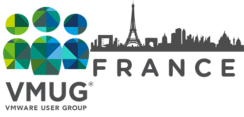 <!-- .element style="max-width:45%;" -->
# vRealize Orchestrator
*Il sait tout faire, même <del>le café</del><ins>du Kubernetes</ins> !*<!-- .element style="font-size:1.2em;" -->
<!-- .slide: class="centered" style="text-align: center;" -->

Note: Bonjour à toutes et à tous,

Avec Antoine, nous allons vous parler d'un produit généralement mal connu dans le portfolio VMware, et qui pourtant permet de faire beaucoup de choses: vRealize Orchestrator.


## Présentations


<!-- .slide: data-menu-title="Groupe SII" -->
**Groupe SII**

* *ESN* (== SSII)
* ~6000 collaborateurs (dev, infra, qualif…)
* Quelques dizaines de profils autour des technos **VMware**:
  * Centre de service (plateau) et assistance technique
  * Architecture, ingénierie et opérations
* VMware *Solution Provider* Partner
* [www.groupe-sii.com](http://www.groupe-sii.com/fr)

Note: Majorité d'appli/dev. Mais aussi des chefs de projet des ingénieurs avant-ventes etc.


<!-- .slide: data-menu-title="Ludovic Rivallain" -->
**Ludovic Rivallain**

Senior Virtualization & Cloud-Computing Consultant à *SII* Ouest.

* [@lrivallain](https://twitter.com/lrivallain)
* [lrivallain@sii.fr](mailto:lrivallain@sii.fr)


<!-- .slide: data-menu-title="Antoine Harlaut" -->
**Antoine Harlaut**

Consultant virtualisation et automatisation à *SII* Ouest.

* [@antoine_hlt](https://twitter.com/antoine_hlt)
* [aharlaut@sii.fr](mailto:aharlaut@sii.fr)


<!-- .slide: data-menu-title="vUptime.io" -->
[](https://vuptime.io)
<!-- .slide: data-background="#2E2E2E" class="centered" data-state="nologo-slide" style="text-align: center;" -->


<!-- .slide: data-menu-title="Historique" -->
## vSO, vCO, vRO… un rapide historique


### Dunes Virtual Services Orchestrator

* **Novembre 2004**:  Dunes Virtual Service Orchestrator 1.0


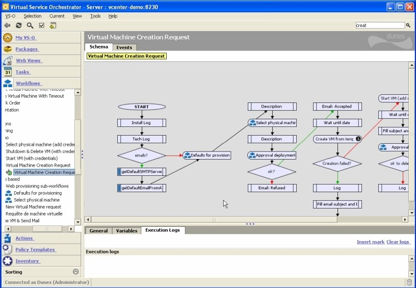<!-- .element class="centered bordered" style="width:90%;" -->
Note: © Image:  http://virtualization.info


### vCenter Orchestrator

* **Septembre 2007**: [Rachat de *Dunes Technologies* par VMware](https://ir.vmware.com/overview/press-releases/press-release-details/2007/VMware-Acquires-Dunes-Technologies/default.aspx):
  * Et notamment son produit: *Dunes Virtual Services Orchestrator*
* **Avril 2009**: * **vC**enter **O**rchestrator 4.0* est distribué par VMware.


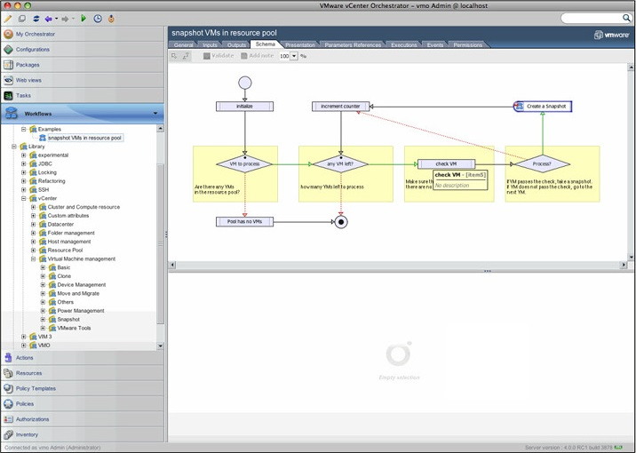<!-- .element class="centered bordered" style="width:90%;" -->
Note: © Image: http://www.vmhub.com/vmware-vcenter-orchestrator


### vRealize Orchestrator

* vCO devient une extension de **vC**loud **A**utomation **C**enter (vCAC, futur vRA)
* Depuis **Octobre 2014**: * **vR**ealize **O**rchestrator*
* Dernière version: vRealize Orchestrator **7.6.0**


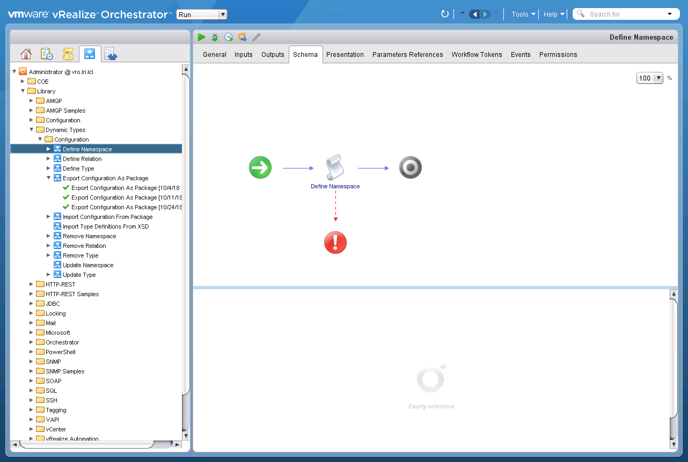<!-- .element class="centered bordered" style="width:100%;" -->


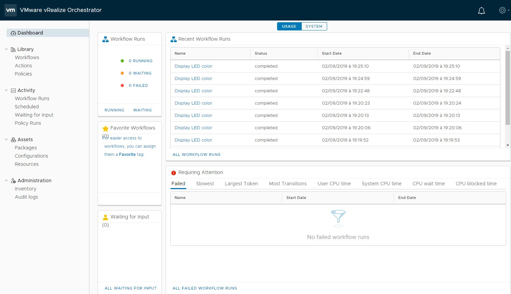<!-- .element class="centered bordered" style="width:100%;" -->


## Orchestration


### Moteur de workflow

vRO est principalement un moteur de workflows…

* programmable(s) de manière visuelle…
* en JavaScript (*les workflows, pas vRO !*)


### Workflow, quésaco ?

> Représentation d'une suite de tâches ou opérations à effectuer.

Le workflow (*WF*) sert à décrire:

* un circuit de traitements
  * Départ/arrivée ou début/fin
* des tâches à répartir entre les différents acteurs d'un processus
* des délais
* des contrôles et les modes de validation


### Le workflow de base (1/4)
<!-- .slide: data-transition="fade" data-transition-speed="slow" -->
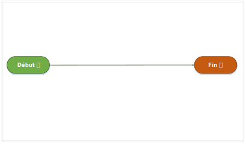<!-- .element class="centered" style="width:120%;" -->


### Le workflow de base (2/4)
<!-- .slide: data-transition="fade" data-transition-speed="slow" -->
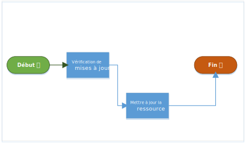<!-- .element class="centered" style="width:120%;" -->


### Le workflow de base (3/4)
<!-- .slide: data-transition="fade" data-transition-speed="slow" -->
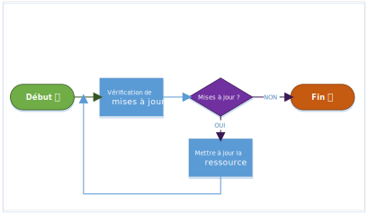<!-- .element class="centered" style="width:120%;" -->


### Le workflow de base (4/4)
<!-- .slide: data-transition="fade" data-transition-speed="slow" -->
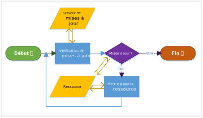<!-- .element class="centered" style="width:120%;" -->


### Entrée & sorties

L'automatisation de tâches se base sur des données:

* connues (*inputs*)
* calculables (à partir des *inputs*) ou de l'écosystème

Éventuellement: produire un résultat exploitable de cette action (*output*).


### Actions d'un workflow

Un workflow peut utiliser différents **actionneurs** pour réaliser son travail:

* <!-- .element class="fragment" -->**internes**: Stocker des variables, calculer des valeurs, gérer l'algorithme…
* <!-- .element class="fragment" -->**externes**: Éléments ne faisant pas partie du moteur pour exécuter une action.


### Réutilisation

Selon les moteurs, certaines briques, ou certains WF sont réutilisables entre eux.

**Ex:** S'authentifier auprès un actionneur externe est certainement une tâche répétée dans plusieurs WF.


### En résumé

Un **workflow** est un:

* Script ou un programme<!-- .element class="fragment" -->
* Visuel<!-- .element class="fragment" -->
* Composé de blocs ou de séquences simples<!-- .element class="fragment" -->
* Réutilisable<!-- .element class="fragment" -->

<!-- .element class="fragment" -->Le tout sera exécuté par un moteur de **workflow**: un orchestrateur.


## Le rôle d'un workflow dans nos pratiques ?


### Automatiser !
<!-- .slide: data-background="#2E2E2E" class="centered" data-state="nologo-slide" style="text-align: center;" -->


### Récurrence
<!-- .slide: class="with_warning_box" -->

L'intérêt de l'automatisation apparaît souvent avec la notion de récurrence.

> Est-ce que vous tenez vraiment à répéter 100x un process manuel ?


### Reproductibilité

Produire toujours le même résultat dans des conditions similaires:

* Réduire le risque d'erreur
* Assurer et prouver une conformité (certifications de sécurité par exemple)


### Autres intérêts de l'automatisation

* Accélérer la mise en oeuvre d'une configuration
* Appliquer rapidement des changements
* Tracer une manipulation
* Réduire les interventions humaines (**Ex:** *- d'astreinte*)
* …

Note:

* Approvisionnement
* Appliquer des patchs de sécurité
* Auto résolution des incidents connus


### La proposition de vRO

* Librairies standards:
  * Contenu initial<!-- .element class="fragment" data-fragment-index="0" -->
  * <!-- .element class="fragment" data-fragment-index="1"-->Contenu proposé par **VMware**
    * <!-- .element class="fragment" data-fragment-index="1" -->Associé aux produits VMware principalement
* <!-- .element class="fragment" data-fragment-index="2" -->Contenus *partners*
* <!-- .element class="fragment" data-fragment-index="3" -->Contenus personnalisés


## Les dessous de vRO
<!-- .slide: data-background="#2E2E2E" class="centered" style="text-align: center;" -->
<!-- .element class="centered bordered" style="width:90%;" -->


### ???

vRO est basé sur `???`

* Moteur de backend = `???`
* Frontend = applet `???`
* Il peut être étendu via des plugins en `???`


### Java !!
<!-- .slide: data-background="#2E2E2E" class="centered" style="text-align: center;" -->
<!-- .element class="centered bordered" style="" -->


vRO est basé sur *Java*

* <!-- .element class="fragment" -->Moteur de backend = *Java*
* <!-- .element class="fragment" -->Frontend = applet *Java*
* <!-- .element class="fragment" -->Il peut être étendu via des plugins en *Java*


### Javascript
<!-- .slide: class="with_warning_box" -->

vRO embarque un moteur permettant l'interprétation du *Javascript*

* Les capacités de ce moteur sont limitées

> N'espérez pas avoir des sélecteurs comme sur jQuery ou un interpréteur digne de celui de votre browser préféré.<!-- .element style="font-size:0.8em;" -->

* Permet d'accéder aux modèles de données (via des managers) définis dans les plugins (*Java*).


### Les avantages du Javascript

* Plus **simple** à appréhender que le Java
* Pas besoin de compiler le code
* Éditable directement dans le client


### Le licensing de vRO
<!-- .slide: style="text-align:center;" -->


### Le licensing de vRO
<!-- .slide: class="with_success_box" -->

vRealize Orchestrator est disponible gratuitement<span style="color:red;">\*</span> si vous disposez déjà d'une licence valide de:

* *vCenter Standard*
* *vRealize Automation* (via *vRealize Suite Advanced/Enterprise*)

> Pas d'excuse!

<div style="font-size: 0.5em; margin-top: 100px;"><span style="color:red;">\*</span> == sans surplus</div>


## Les interfaces


### Client Java

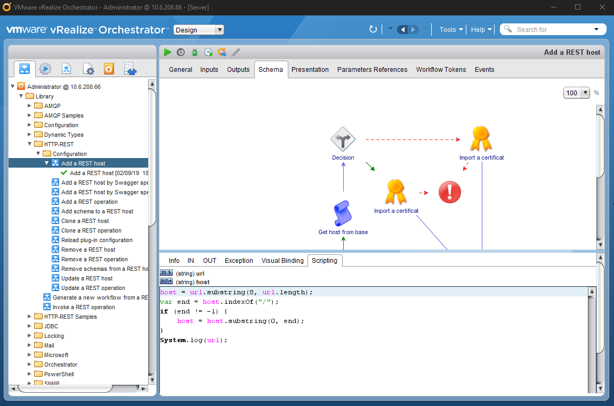<!-- .element class="centered bordered" style="width:90%; margin-left:5%;" -->


### HTML5 ready
#### Quelques habitudes à changer…

* Voir
* Éxécuter:
  * Run
  * Schedule
* Éditer (>= 7.6)
* Organisation par *tag*


### HTML5

<!-- .element class="centered bordered" style="width:100%;" -->


#### Control center

Gestion de l'appliance et/ou du cluster:

* Gestion base de données
* Startup options
* Ajout de plugins
* Troubleshooting
* …


### Control center
<!-- .slide: style="text-align:center;" -->

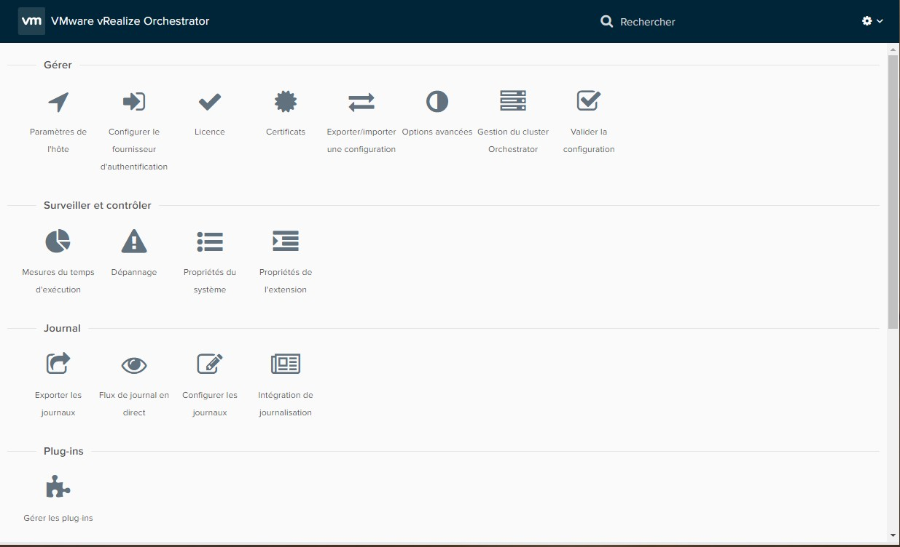<!-- .element class="centered bordered" style="width:90%;" -->


### Developper resources
<!-- .slide: style="text-align:center;" -->

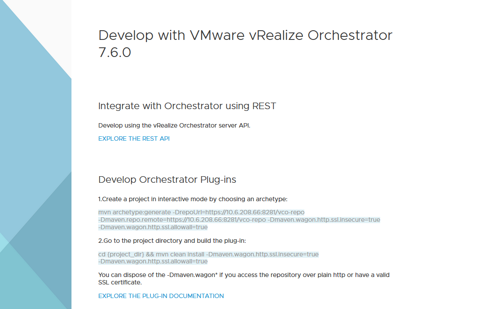<!-- .element class="centered bordered" style="width:90%;z-index:-1;" -->


### API REST

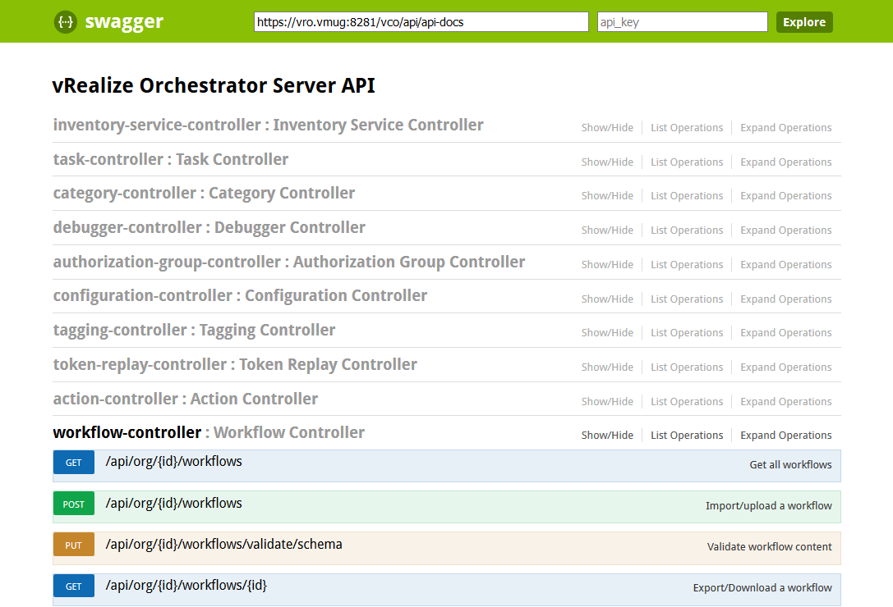<!-- .element class="centered bordered" style="width:85%; margin-left:8%;" -->


## Les objets vRO


### Plugins/Inventaire

L'inventaire de vRO permet de parcourir dynamiquement les endpoints qui y sont reliés:

* vCenter
* NSX
* AD
* BDD SQL
* …

Cela peut inclure des modèles personnalisés (via les plugins customs).


#### Exemple inventaire vCenter

<!-- .slide: style="text-align:center;" -->
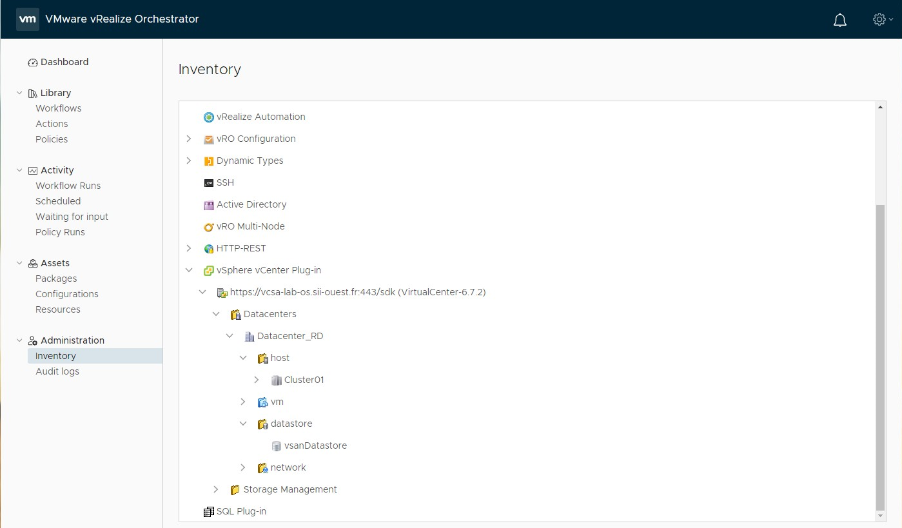<!-- .element class="centered bordered" style="width:100%;" -->


### Workflow

Scénario exécutable basé sur des:

* `inputs`
* `outputs` (optionnelles)
* `attributes` (variables)
* Tests et éléments d'algorithme
* Actionneurs


#### Exemple de workflow

<!-- .slide: style="text-align:center;" -->
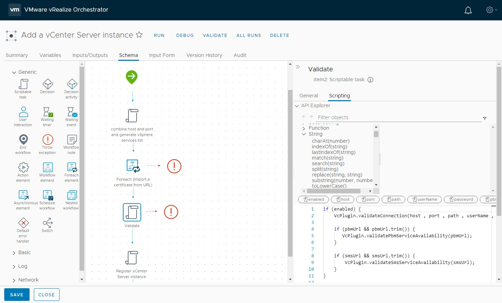<!-- .element class="centered bordered" style="width:100%;" -->


#### Exemple de formulaire

<!-- .slide: style="text-align:center;" -->
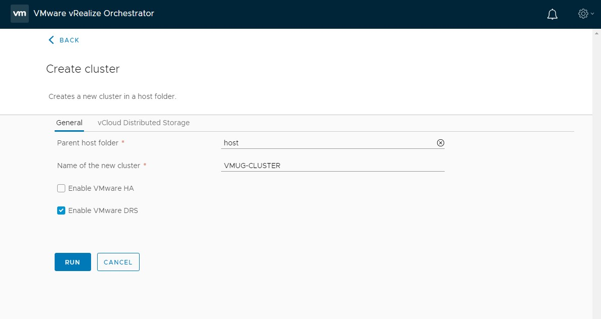<!-- .element class="centered bordered" style="width:80%;" -->


### Actions

Équivalent d'une *fonction* Javascript:

* **Réutilisable** (WF, autre action etc.)
* Des `inputs`
* Une `output` optionnelle

Les actions sont organisées dans des *modules*.

**Ex:**

```js
isHaEnabled = System.getModule("com.vmware.library.vc.cluster")
                .haEnabledCluster(cluster);
```
<!-- .element class="big_code" -->


#### Conseils
<!-- .slide: class="with_info_box" -->

> Les actions c'est bon, mangez-en !

<!-- .element class="centered bordered" -->

Prévoyez des actions **génériques**:

* <!-- .element class="fragment" data-fragment-index="0"-->Facilement réutilisables
* <!-- .element class="fragment" data-fragment-index="0"-->Configurables via les `inputs`
* <!-- .element class="fragment" data-fragment-index="0"-->De**s** module**s** par thème d'actionneurs


#### Exemples de modules

* Module `com.sii.vcenter.sso.configuration/`
  * Action `read_sso_configuration`
  * Action `push_sso_configuration`
* <!-- .element class="fragment" data-fragment-index="0"-->Module `com.sii.vcenter.sso.identity_sources/`
  * <!-- .element class="fragment" data-fragment-index="0"-->Action `list_sso_identity_sources`
  * <!-- .element class="fragment" data-fragment-index="0"-->Action `add_sso_identity_sources`
  * <!-- .element class="fragment" data-fragment-index="0"-->Action `del_sso_identity_sources`
* <!-- .element class="fragment" data-fragment-index="1"-->Module `com.sii.vcenter.sso.local_users/`
  * <!-- .element class="fragment" data-fragment-index="1"-->Action `list_local_users`
  * <!-- .element class="fragment" data-fragment-index="1"-->Action `add_local_users`
  * <!-- .element class="fragment" data-fragment-index="1"-->Action `del_local_users`


### Configuration Elements
<!-- .slide: class="with_info_box" -->

Liste d'attributs permettant de définir des constantes.

> == un fichier de configuration

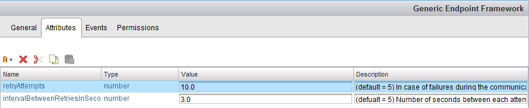<!-- .element class="centered bordered" -->


### Resource Elements

Ressources diverses pouvant être utilisées dans le contexte d'un autre élément vRO:

* Fichiers de référence (qui n'évolue pas souvent)
* Images
* Templates XML ou HTML
* Scripts
* Certificats d'autorités
* …

<div style="font-size: 0.5em; margin-top: 100px;">Taille des fichiers limitée à *16MB*.</div>


### Schedulers
<!-- .slide: style="text-align:center;" -->

*Comme partout dans le monde IT*: Exécuter des tâches selon une programmation temporelle.

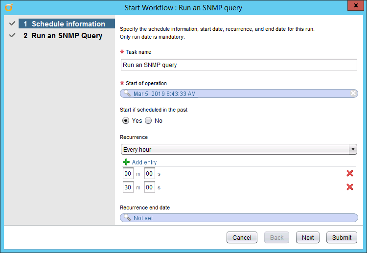<!-- .element class="centered bordered" -->


### Policies

Déclenchement d'action(s) (workflow) selon des évènements.

De base, les évènements suivants sont disponibles:

* SNMP
* AMQP
* Vérification périodique
* Autre *policy* (début et fin)


### Packages

Un package permet la distribution d'éléments de contenu de vRO:

* Workflows
* Actions
* Template de Policies
* Configuration et Resource Elements


### Packages

Un  package peut être:

* Exporté
* (Ré-)importé
* Sauvegardé
* Synchronisé…

<!-- .element class="fragment" -->Il permet aussi de détecter et inclure les **dépendances** entres éléments.


### Versioning

Certains éléments supportent le versioning:

* Workflow
* Action
* Configuration et Resource Elements

Cela permet de vérifier l'historique des modifications et de controller le processus de mise à jour.


### Exemple de versioning

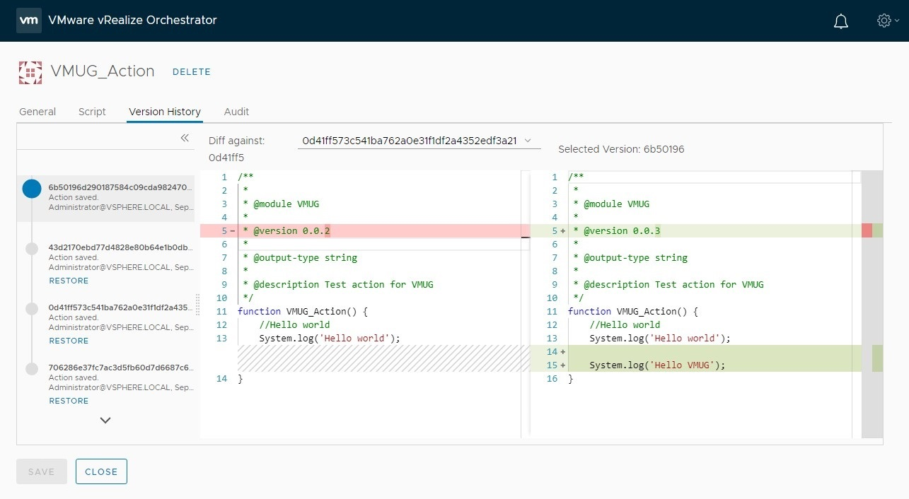<!-- .element class="centered bordered" -->


## Uses-cases
<!-- .slide: data-background="#2E2E2E" data-state="nologo-slide" style="text-align: center;" -->
<!-- .element class="centered bordered" style="width:70%;" -->


### Disclaimer

Les *uses-cases* suivants s'appuient sur quelques longues années d'utilisation de vCO/vRO avec nos clients.

<!-- .element class="fragment" -->Ils expriment un certain *biais* lié à notre activité d'*ESN* mais permettent d'avoir une idée des capacités de cet outil.

<!-- .element class="fragment" -->La principale limite de vRO: **votre imagination**.


### On aurait pu le faire avec vRO aussi…
<!-- .slide: style="text-align:center;" -->

😉

<div class="tweet" data-src="https://twitter.com/cqchu/status/1102968952542629888">
[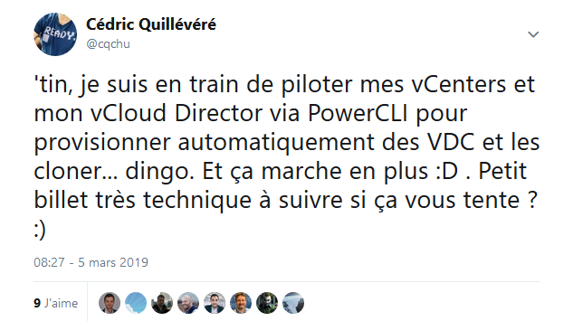<!-- .element class="centered bordered" style="width:70%;"-->](https://twitter.com/cqchu/status/1102968952542629888)
</div>


### Use-Case: On-boarding

Automatiser l'arrivée d'un nouveau client/service/utilisateur dans votre SI:

* <!-- .element class="fragment" -->Création des comptes AD, *Unix
* <!-- .element class="fragment" -->Création des accès à des services non-*AD friendly*
* <!-- .element class="fragment" -->Création des accès à des services externes (merci le *cloud* !)
* <!-- .element class="fragment" -->Routines internes…


### Use-Case: Migration(s)

Exporter la structure d'une organisation **vCloud Director** afin de la réimporter dans un autre déploiement via un mapping pré-défini.

Dans le use-case d'un de nos clients, l'opération était réalisée manuellement <!-- .element class="fragment" -->
(`~15min/VM`) et a été grandement accélérée/sécurisée par l'usage d'un WF vRO
(`~2min/VM`).


### Use-Case: Extension de fonctionnalités
#### Blocking tasks

La notion de *Blocking tasks* sur **vCloud Director** permet d'intervenir avant/pendant/après le déploiement d'une ressource.

En utilisant vRO+AMQP (RabbitMQ), on peut par exemple:<!-- .element class="fragment" -->

* Renseigner un outil de gestion de parc.<!-- .element class="fragment" -->
* Demander le monitoring, le backup de la ressource.<!-- .element class="fragment" -->
* Insérer un mécanisme d'approbation des demandes.<!-- .element class="fragment" -->
* Inclure dans un groupe DRS particulier…<!-- .element class="fragment" -->


### Use-Case: Extension de fonctionnalités
#### Multi-cloud

**vRealize Automation** + vRO ⇉ *XaaS*.

**Ex:** Ajouter le support d'un cloud public initialement non pris en charge par vRA.

`dynamicTypes` + call API *REST* via le plugin natif de vRO

⇉ déploiement IaaS dans ce nouveau cloud public<!-- .element class="fragment" -->

Note: XaaS: Everything-as-a-Service


### Use-Case: Interconnexions de produits tiers
<!-- .slide: class="with_info_box" -->

> Il était une fois *(~8ans)*…

Interaction avec des équipements réseaux pour provisionner automatiquement des environnements clients (*le SDN avant l'heure!*):

* Partition F5/BigIP
* VSYS Juniper
* VRF Cisco…


## Démo !
<!-- .slide: data-background="#2E2E2E" data-state="nologo-slide" style="text-align: center;" -->


## Conclusion & questions
<!-- .slide: style="text-align:center;" -->

Les slides de la présentation:

[vupti.me/vmug2019](https://vupti.me/vmug2019)


## Merci !
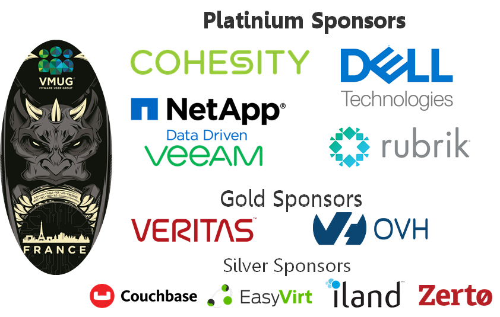
<!-- .slide: style="text-align: center;" -->